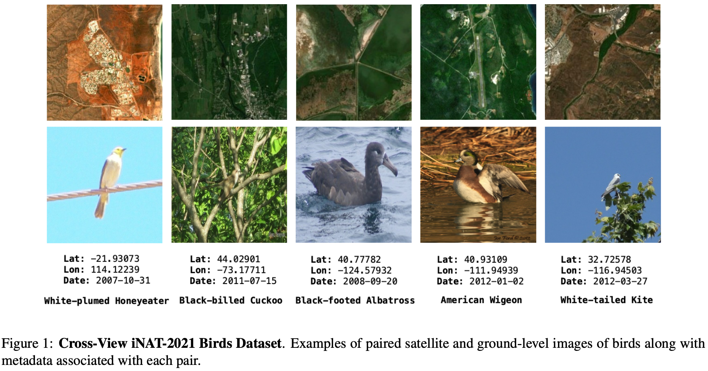
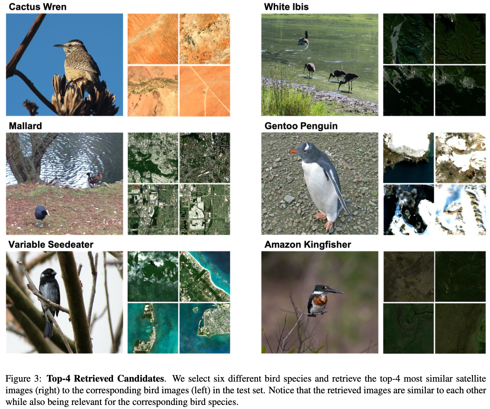

# BirdSAT: Cross-View Contrastive Masked Autoencoders for Bird Species Classification and Mapping

## 🦢 Dataset Released: Cross-View iNAT Birds 2021
This cross-view birds species dataset consists of paired ground-level bird images and satellite images, along with meta-information associated with the iNaturalist-2021 dataset.

Satellite images along with meta-information - [Link](https://wustl.box.com/s/jtt1xbap6xpzvqfbeedq0wxu5ciqqc7a)

iNaturalist Images - [Link](https://github.com/visipedia/inat_comp/tree/master/2021)



#### Computer Vision Tasks
1. Fine-Grained image classification
2. Satellite-to-bird image retrieval
3. Bird-to-satellite image retrieval
4. Geolocalization of Bird Species

An example of task 3 is shown below:



## 👨‍💻 Getting Started 

#### Setting up 
1. Clone this repository:
```bash
git clone https://github.com/mvrl/BirdSAT.git
```
2. Clone the Remote-Sensing-RVSA repository inside BirdSAT:
```bash
cd BirdSAT
git clone https://github.com/ViTAE-Transformer/Remote-Sensing-RVSA.git
```
3. **Append** the code for CVMMAE present in `utils_model/CVMMAE.py` to the file present in `Remote-Sensing-RVSA/MAEPretrain_SceneClassification/models_mae_vitae.py`

4. Download pretrained satellite image encoder from - [Link](https://1drv.ms/u/s!AimBgYV7JjTlgUIde2jzcjrrWasP?e=gyLn29) and place inside folder `pretrained_models`.

5. Download all datasets and place inside folder `data`.

#### Installing Required Packages
There are two options to setup your environment to be able to run all the functions in the repository:
1. Using Dockerfile provided in the repository to create a docker image with all required packages:
    ```bash
    docker build -t <your-docker-hub-id>/birdsat .
    ```
2. Creating conda Environment with all required packages:
    ```bash
    conda create -n birdsat python=3.10 && \
    conda activate birdsat && \
    pip install requirements.txt
    ```
Additionally, we have hosted a pre-built docker image on docker hub with tag `srikumar26/birdsat:latest` for use.

## 🔥 Training Models
1. Setup all the parameters of interest inside `config.py` before launching the training script.
2. Run pre-training by calling:
    ```bash
    python pretrain.py
    ```
3. Run fine-tuning by calling:
    ```bash
    python finetune.py
    ```

## ❄️ Pretrained Models
Download pretrained models from the given links below:

|Model Type|Download Url|
|----------|--------|
|CVE-MAE|[Link](https://wustl.box.com/s/o1ooaunhaym7v1qj3yzj3vof0lskxyha)|
|CVE-MAE-Meta| [Link](https://wustl.box.com/s/fudo44eznjwejcp3vql14by20rqqayfy)|
|CVM-MAE| [Link](https://wustl.box.com/s/xuezslrnjxyz1d1ngtzvnm5ck2il4nx8)|
|CVM-MAE-Meta| [Link](https://wustl.box.com/s/c3nfbdmcigiogqskemyc4h5soveiya8n)|


## 📑 Citation

```bibtex
@inproceedings{sastry2024birdsat,
  title={BirdSAT: Cross-View Contrastive Masked Autoencoders for Bird Species Classification and Mapping},
  author={Srikumar, Sastry and Subash, Khanal and Aayush, Dhakal and Huang, Di and Nathan, Jacobs},
  booktitle={Proceedings of the IEEE/CVF Winter Conference on Applications of Computer Vision},
  year={2024}
}
```

## 🔍 Additional Links
Check out our lab website for other interesting works on geospatial understanding and mapping;
* Multi-Modal Vision Research Lab (MVRL) - [Link](https://mvrl.cse.wustl.edu/)
* Related Works from MVRL - [Link](https://mvrl.cse.wustl.edu/publications/)